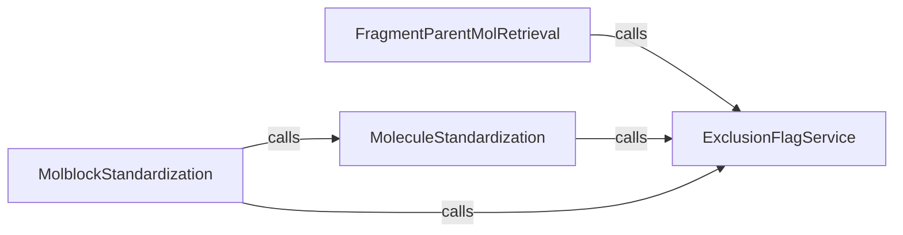

## Component Details

This system provides a comprehensive set of utilities for standardizing chemical structures, including functions to exclude undesirable structures based on predefined criteria, retrieve parent molecules from fragments, and standardize molecules from various input formats like molblocks. The core functionality revolves around ensuring chemical structures meet specific quality and format standards for further processing.

### ExclusionFlagService

Provides a utility function to determine if a chemical structure should be excluded based on predefined criteria, such as the presence of metallic atoms, a high count of boron atoms, or RDKit sanitization failures. It acts as a gatekeeper for molecular processing.

**Related Classes/Methods**:

- <a href="https://github.com/chembl/ChEMBL_Structure_Pipeline/blob/master/chembl_structure_pipeline/exclude_flag.py#L84-L113" target="_blank" rel="noopener noreferrer">`chembl_structure_pipeline.exclude_flag.exclude_flag` (84:113)</a>

### FragmentParentMolRetrieval

Responsible for retrieving the parent molecule from a set of fragments, handling solvent and salt removal, and optionally neutralizing the molecule. It utilizes the ExclusionFlagService to check if the molecule should be excluded from further processing.

**Related Classes/Methods**:

- <a href="https://github.com/chembl/ChEMBL_Structure_Pipeline/blob/master/chembl_structure_pipeline/standardizer.py#L290-L427" target="_blank" rel="noopener noreferrer">`chembl_structure_pipeline.standardizer.get_fragment_parent_mol` (290:427)</a>

### MoleculeStandardization

Standardizes a given molecule by applying a series of transformations including updating valences, removing s-groups, kekulizing, removing hydrogens, normalizing, uncharging, flattening tartrates, and cleaning up drawing. It utilizes the ExclusionFlagService for an initial exclusion check.

**Related Classes/Methods**:

- <a href="https://github.com/chembl/ChEMBL_Structure_Pipeline/blob/master/chembl_structure_pipeline/standardizer.py#L455-L472" target="_blank" rel="noopener noreferrer">`chembl_structure_pipeline.standardizer.standardize_mol` (455:472)</a>

### MolblockStandardization

Handles the standardization of molecules provided in molblock format. It parses the molblock, utilizes the ExclusionFlagService for an exclusion check, and then uses the MoleculeStandardization component to process the molecule before converting the standardized molecule back into a molblock.

**Related Classes/Methods**:

- <a href="https://github.com/chembl/ChEMBL_Structure_Pipeline/blob/master/chembl_structure_pipeline/standardizer.py#L508-L513" target="_blank" rel="noopener noreferrer">`chembl_structure_pipeline.standardizer.standardize_molblock` (508:513)</a>

### [FAQ](https://github.com/CodeBoarding/GeneratedOnBoardings/tree/main?tab=readme-ov-file#faq)