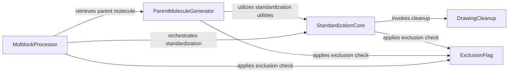

## Component Details

The Structure Standardization subsystem is designed to process and normalize chemical structures, ensuring consistent and chemically correct representations. Its main flow involves cleaning drawing artifacts, handling fragments and isotopes, uncharging molecules, and applying general standardization rules to derive a 'parent' molecule from an input. This is achieved through a core standardization component, a parent molecule generator, a drawing cleanup component, and a molblock processor, all of which may interact with an exclusion flag component to filter out unwanted structures.

### StandardizationCore

This component encapsulates the fundamental chemical structure standardization algorithms, including valence adjustments, s-group removal, kekulization, hydrogen removal, normalization, uncharging, and specific structural flattening, ensuring molecular data consistency.

**Related Classes/Methods**:

- <a href="https://github.com/chembl/ChEMBL_Structure_Pipeline/blob/master/chembl_structure_pipeline/standardizer.py#L455-L472" target="_blank" rel="noopener noreferrer">`ChEMBL_Structure_Pipeline.chembl_structure_pipeline.standardizer.standardize_mol` (455:472)</a>

- <a href="https://github.com/chembl/ChEMBL_Structure_Pipeline/blob/master/chembl_structure_pipeline/standardizer.py#L26-L29" target="_blank" rel="noopener noreferrer">`ChEMBL_Structure_Pipeline.chembl_structure_pipeline.standardizer.update_mol_valences` (26:29)</a>

- <a href="https://github.com/chembl/ChEMBL_Structure_Pipeline/blob/master/chembl_structure_pipeline/standardizer.py#L147-L150" target="_blank" rel="noopener noreferrer">`ChEMBL_Structure_Pipeline.chembl_structure_pipeline.standardizer.remove_sgroups_from_mol` (147:150)</a>

- <a href="https://github.com/chembl/ChEMBL_Structure_Pipeline/blob/master/chembl_structure_pipeline/standardizer.py#L21-L23" target="_blank" rel="noopener noreferrer">`ChEMBL_Structure_Pipeline.chembl_structure_pipeline.standardizer.kekulize_mol` (21:23)</a>

- <a href="https://github.com/chembl/ChEMBL_Structure_Pipeline/blob/master/chembl_structure_pipeline/standardizer.py#L75-L144" target="_blank" rel="noopener noreferrer">`ChEMBL_Structure_Pipeline.chembl_structure_pipeline.standardizer.remove_hs_from_mol` (75:144)</a>

- <a href="https://github.com/chembl/ChEMBL_Structure_Pipeline/blob/master/chembl_structure_pipeline/standardizer.py#L62-L72" target="_blank" rel="noopener noreferrer">`ChEMBL_Structure_Pipeline.chembl_structure_pipeline.standardizer.normalize_mol` (62:72)</a>

- <a href="https://github.com/chembl/ChEMBL_Structure_Pipeline/blob/master/chembl_structure_pipeline/standardizer.py#L153-L191" target="_blank" rel="noopener noreferrer">`ChEMBL_Structure_Pipeline.chembl_structure_pipeline.standardizer.uncharge_mol` (153:191)</a>

- <a href="https://github.com/chembl/ChEMBL_Structure_Pipeline/blob/master/chembl_structure_pipeline/standardizer.py#L269-L282" target="_blank" rel="noopener noreferrer">`ChEMBL_Structure_Pipeline.chembl_structure_pipeline.standardizer.flatten_tartrate_mol` (269:282)</a>

### ParentMoleculeGenerator

This component is responsible for deriving the parent molecule from a given chemical structure, handling both isotopic and fragmented parent forms. It relies on core standardization utilities and exclusion checks to produce the canonical parent.

**Related Classes/Methods**:

- <a href="https://github.com/chembl/ChEMBL_Structure_Pipeline/blob/master/chembl_structure_pipeline/standardizer.py#L438-L443" target="_blank" rel="noopener noreferrer">`ChEMBL_Structure_Pipeline.chembl_structure_pipeline.standardizer.get_parent_mol` (438:443)</a>

- <a href="https://github.com/chembl/ChEMBL_Structure_Pipeline/blob/master/chembl_structure_pipeline/standardizer.py#L430-L435" target="_blank" rel="noopener noreferrer">`ChEMBL_Structure_Pipeline.chembl_structure_pipeline.standardizer.get_isotope_parent_mol` (430:435)</a>

- <a href="https://github.com/chembl/ChEMBL_Structure_Pipeline/blob/master/chembl_structure_pipeline/standardizer.py#L290-L427" target="_blank" rel="noopener noreferrer">`ChEMBL_Structure_Pipeline.chembl_structure_pipeline.standardizer.get_fragment_parent_mol` (290:427)</a>

### DrawingCleanup

This component specifically addresses and corrects common drawing artifacts in chemical structures, such as misconfigured triple bonds and allenes, to improve the accuracy of molecular representations.

**Related Classes/Methods**:

- <a href="https://github.com/chembl/ChEMBL_Structure_Pipeline/blob/master/chembl_structure_pipeline/standardizer.py#L252-L266" target="_blank" rel="noopener noreferrer">`ChEMBL_Structure_Pipeline.chembl_structure_pipeline.standardizer.cleanup_drawing_mol` (252:266)</a>

- <a href="https://github.com/chembl/ChEMBL_Structure_Pipeline/blob/master/chembl_structure_pipeline/standardizer.py#L223-L237" target="_blank" rel="noopener noreferrer">`ChEMBL_Structure_Pipeline.chembl_structure_pipeline.standardizer._cleanup_triple_bonds` (223:237)</a>

- <a href="https://github.com/chembl/ChEMBL_Structure_Pipeline/blob/master/chembl_structure_pipeline/standardizer.py#L213-L220" target="_blank" rel="noopener noreferrer">`ChEMBL_Structure_Pipeline.chembl_structure_pipeline.standardizer._check_and_straighten_at_triple_bond` (213:220)</a>

- <a href="https://github.com/chembl/ChEMBL_Structure_Pipeline/blob/master/chembl_structure_pipeline/standardizer.py#L240-L249" target="_blank" rel="noopener noreferrer">`ChEMBL_Structure_Pipeline.chembl_structure_pipeline.standardizer._cleanup_allenes` (240:249)</a>

### MolblockProcessor

This component manages the input and output of chemical structures in Molblock format, including parsing, reapplication of wedging information, and orchestrating the standardization and parent molecule generation processes for Molblock data.

**Related Classes/Methods**:

- <a href="https://github.com/chembl/ChEMBL_Structure_Pipeline/blob/master/chembl_structure_pipeline/standardizer.py#L486-L505" target="_blank" rel="noopener noreferrer">`ChEMBL_Structure_Pipeline.chembl_structure_pipeline.standardizer.parse_molblock` (486:505)</a>

- <a href="https://github.com/chembl/ChEMBL_Structure_Pipeline/blob/master/chembl_structure_pipeline/standardizer.py#L508-L513" target="_blank" rel="noopener noreferrer">`ChEMBL_Structure_Pipeline.chembl_structure_pipeline.standardizer.standardize_molblock` (508:513)</a>

- <a href="https://github.com/chembl/ChEMBL_Structure_Pipeline/blob/master/chembl_structure_pipeline/standardizer.py#L475-L483" target="_blank" rel="noopener noreferrer">`ChEMBL_Structure_Pipeline.chembl_structure_pipeline.standardizer.reapply_molblock_wedging` (475:483)</a>

- <a href="https://github.com/chembl/ChEMBL_Structure_Pipeline/blob/master/chembl_structure_pipeline/standardizer.py#L446-L452" target="_blank" rel="noopener noreferrer">`ChEMBL_Structure_Pipeline.chembl_structure_pipeline.standardizer.get_parent_molblock` (446:452)</a>

### ExclusionFlag

This component provides a mechanism to determine if a chemical structure should be excluded from certain processing steps, based on predefined rules or properties, preventing unwanted or invalid structures from proceeding through the pipeline.

**Related Classes/Methods**:

- <a href="https://github.com/chembl/ChEMBL_Structure_Pipeline/blob/master/chembl_structure_pipeline/exclude_flag.py#L84-L113" target="_blank" rel="noopener noreferrer">`ChEMBL_Structure_Pipeline.chembl_structure_pipeline.exclude_flag.exclude_flag` (84:113)</a>

### [FAQ](https://github.com/CodeBoarding/GeneratedOnBoardings/tree/main?tab=readme-ov-file#faq)