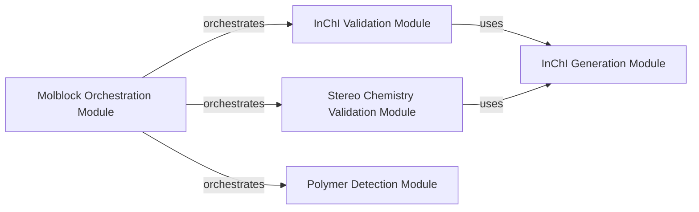

## Component Details

The Structure Validation subsystem is responsible for ensuring the integrity and correctness of chemical structures. It orchestrates various specialized modules to perform checks on InChI strings, stereochemistry, and general molblock validity. The main flow involves generating InChI from molblocks, validating the InChI and stereochemical information, detecting polymers, and aggregating all validation results to provide a comprehensive assessment of the chemical structure's quality and identify any inconsistencies.

### InChI Generation Module

This component is responsible for generating InChI strings and handling associated warnings from molblocks. It serves as a foundational utility for other modules requiring InChI data.

**Related Classes/Methods**:

- <a href="https://github.com/chembl/ChEMBL_Structure_Pipeline/blob/master/chembl_structure_pipeline/checker.py#L41-L48" target="_blank" rel="noopener noreferrer">`ChEMBL_Structure_Pipeline.chembl_structure_pipeline.checker.get_inchi` (41:48)</a>

- <a href="https://github.com/chembl/ChEMBL_Structure_Pipeline/blob/master/chembl_structure_pipeline/checker.py#L20-L22" target="_blank" rel="noopener noreferrer">`ChEMBL_Structure_Pipeline.chembl_structure_pipeline.checker._get_molblock_inchi_and_warnings` (20:22)</a>

### InChI Validation Module

This component provides functionalities to validate InChI strings and calculate a score based on the warnings generated during InChI creation, indicating the quality or issues with the InChI.

**Related Classes/Methods**:

- <a href="https://github.com/chembl/ChEMBL_Structure_Pipeline/blob/master/chembl_structure_pipeline/checker.py#L65-L70" target="_blank" rel="noopener noreferrer">`ChEMBL_Structure_Pipeline.chembl_structure_pipeline.checker.InchiChecker.check` (65:70)</a>

- <a href="https://github.com/chembl/ChEMBL_Structure_Pipeline/blob/master/chembl_structure_pipeline/checker.py#L73-L117" target="_blank" rel="noopener noreferrer">`ChEMBL_Structure_Pipeline.chembl_structure_pipeline.checker.InchiChecker.get_inchi_score` (73:117)</a>

### Stereo Chemistry Validation Module

This component focuses on analyzing and scoring the stereochemical information present in molblocks by comparing different stereo counts derived from InChI, Mol, and RDKit, identifying potential discrepancies.

**Related Classes/Methods**:

- <a href="https://github.com/chembl/ChEMBL_Structure_Pipeline/blob/master/chembl_structure_pipeline/checker.py#L127-L177" target="_blank" rel="noopener noreferrer">`ChEMBL_Structure_Pipeline.chembl_structure_pipeline.checker.StereoChecker.get_stereo_counts` (127:177)</a>

- <a href="https://github.com/chembl/ChEMBL_Structure_Pipeline/blob/master/chembl_structure_pipeline/checker.py#L180-L186" target="_blank" rel="noopener noreferrer">`ChEMBL_Structure_Pipeline.chembl_structure_pipeline.checker.StereoChecker.check` (180:186)</a>

- <a href="https://github.com/chembl/ChEMBL_Structure_Pipeline/blob/master/chembl_structure_pipeline/checker.py#L189-L199" target="_blank" rel="noopener noreferrer">`ChEMBL_Structure_Pipeline.chembl_structure_pipeline.checker.StereoChecker.get_stereo_score` (189:199)</a>

### Molblock Orchestration Module

This is the primary entry point for comprehensive molblock validation. It orchestrates various checks from specialized checker modules, including InChI, stereo, and polymer checks, and aggregates their results to provide an overall validation status.

**Related Classes/Methods**:

- <a href="https://github.com/chembl/ChEMBL_Structure_Pipeline/blob/master/chembl_structure_pipeline/checker.py#L486-L509" target="_blank" rel="noopener noreferrer">`ChEMBL_Structure_Pipeline.chembl_structure_pipeline.checker.check_molblock` (486:509)</a>

### Polymer Detection Module

This specialized component is responsible for checking the presence of polymer-related patterns within the molblock data, indicating if the structure represents a polymer.

**Related Classes/Methods**:

- <a href="https://github.com/chembl/ChEMBL_Structure_Pipeline/blob/master/chembl_structure_pipeline/checker.py#L452-L453" target="_blank" rel="noopener noreferrer">`ChEMBL_Structure_Pipeline.chembl_structure_pipeline.checker.PolymerFileChecker.check` (452:453)</a>

### [FAQ](https://github.com/CodeBoarding/GeneratedOnBoardings/tree/main?tab=readme-ov-file#faq)