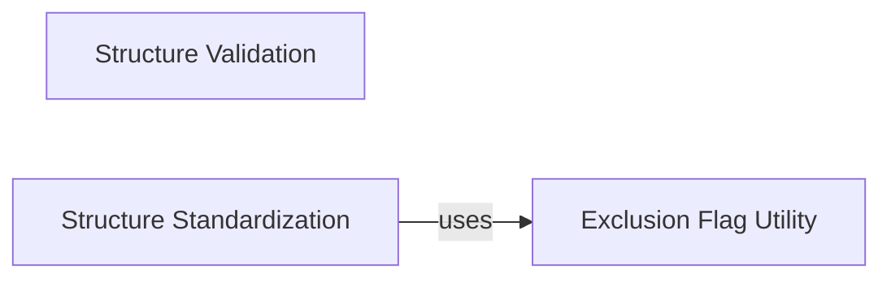

## Component Details

This graph represents the core functionality of the ChEMBL Structure Pipeline, which is designed to process and manage chemical structures. The main flow involves validating incoming chemical structures for integrity and correctness, standardizing them to a consistent and chemically sound representation, and then applying exclusion rules to filter out undesirable structures. This ensures that only high-quality, standardized chemical data is maintained within the system.

### Structure Validation

This component is responsible for validating chemical structures and their properties. It includes checks for InChI integrity, stereochemistry, and general molblock validity, identifying potential issues or inconsistencies in the structural representation. It also provides scoring based on the severity of identified issues.

**Related Classes/Methods**:

- <a href="https://github.com/chembl/ChEMBL_Structure_Pipeline/blob/master/chembl_structure_pipeline/checker.py#L41-L48" target="_blank" rel="noopener noreferrer">`ChEMBL_Structure_Pipeline.chembl_structure_pipeline.checker.get_inchi` (41:48)</a>

- <a href="https://github.com/chembl/ChEMBL_Structure_Pipeline/blob/master/chembl_structure_pipeline/checker.py#L20-L22" target="_blank" rel="noopener noreferrer">`ChEMBL_Structure_Pipeline.chembl_structure_pipeline.checker._get_molblock_inchi_and_warnings` (20:22)</a>

- <a href="https://github.com/chembl/ChEMBL_Structure_Pipeline/blob/master/chembl_structure_pipeline/checker.py#L65-L70" target="_blank" rel="noopener noreferrer">`ChEMBL_Structure_Pipeline.chembl_structure_pipeline.checker.InchiChecker.check` (65:70)</a>

- <a href="https://github.com/chembl/ChEMBL_Structure_Pipeline/blob/master/chembl_structure_pipeline/checker.py#L73-L117" target="_blank" rel="noopener noreferrer">`ChEMBL_Structure_Pipeline.chembl_structure_pipeline.checker.InchiChecker.get_inchi_score` (73:117)</a>

- <a href="https://github.com/chembl/ChEMBL_Structure_Pipeline/blob/master/chembl_structure_pipeline/checker.py#L127-L177" target="_blank" rel="noopener noreferrer">`ChEMBL_Structure_Pipeline.chembl_structure_pipeline.checker.StereoChecker.get_stereo_counts` (127:177)</a>

- <a href="https://github.com/chembl/ChEMBL_Structure_Pipeline/blob/master/chembl_structure_pipeline/checker.py#L180-L186" target="_blank" rel="noopener noreferrer">`ChEMBL_Structure_Pipeline.chembl_structure_pipeline.checker.StereoChecker.check` (180:186)</a>

- <a href="https://github.com/chembl/ChEMBL_Structure_Pipeline/blob/master/chembl_structure_pipeline/checker.py#L189-L199" target="_blank" rel="noopener noreferrer">`ChEMBL_Structure_Pipeline.chembl_structure_pipeline.checker.StereoChecker.get_stereo_score` (189:199)</a>

- <a href="https://github.com/chembl/ChEMBL_Structure_Pipeline/blob/master/chembl_structure_pipeline/checker.py#L486-L509" target="_blank" rel="noopener noreferrer">`ChEMBL_Structure_Pipeline.chembl_structure_pipeline.checker.check_molblock` (486:509)</a>

- <a href="https://github.com/chembl/ChEMBL_Structure_Pipeline/blob/master/chembl_structure_pipeline/checker.py#L452-L453" target="_blank" rel="noopener noreferrer">`ChEMBL_Structure_Pipeline.chembl_structure_pipeline.checker.PolymerFileChecker.check` (452:453)</a>

### Structure Standardization

This component focuses on processing and normalizing chemical structures. It performs various operations such as cleaning up drawing artifacts, handling fragments and isotopes, uncharging molecules, and applying general standardization rules to ensure consistent and chemically correct representations. It aims to derive a 'parent' molecule from a given input.

**Related Classes/Methods**:

- <a href="https://github.com/chembl/ChEMBL_Structure_Pipeline/blob/master/chembl_structure_pipeline/standardizer.py#L223-L237" target="_blank" rel="noopener noreferrer">`ChEMBL_Structure_Pipeline.chembl_structure_pipeline.standardizer._cleanup_triple_bonds` (223:237)</a>

- <a href="https://github.com/chembl/ChEMBL_Structure_Pipeline/blob/master/chembl_structure_pipeline/standardizer.py#L213-L220" target="_blank" rel="noopener noreferrer">`ChEMBL_Structure_Pipeline.chembl_structure_pipeline.standardizer._check_and_straighten_at_triple_bond` (213:220)</a>

- <a href="https://github.com/chembl/ChEMBL_Structure_Pipeline/blob/master/chembl_structure_pipeline/standardizer.py#L240-L249" target="_blank" rel="noopener noreferrer">`ChEMBL_Structure_Pipeline.chembl_structure_pipeline.standardizer._cleanup_allenes` (240:249)</a>

- <a href="https://github.com/chembl/ChEMBL_Structure_Pipeline/blob/master/chembl_structure_pipeline/standardizer.py#L252-L266" target="_blank" rel="noopener noreferrer">`ChEMBL_Structure_Pipeline.chembl_structure_pipeline.standardizer.cleanup_drawing_mol` (252:266)</a>

- <a href="https://github.com/chembl/ChEMBL_Structure_Pipeline/blob/master/chembl_structure_pipeline/standardizer.py#L290-L427" target="_blank" rel="noopener noreferrer">`ChEMBL_Structure_Pipeline.chembl_structure_pipeline.standardizer.get_fragment_parent_mol` (290:427)</a>

- <a href="https://github.com/chembl/ChEMBL_Structure_Pipeline/blob/master/chembl_structure_pipeline/standardizer.py#L153-L191" target="_blank" rel="noopener noreferrer">`ChEMBL_Structure_Pipeline.chembl_structure_pipeline.standardizer.uncharge_mol` (153:191)</a>

- <a href="https://github.com/chembl/ChEMBL_Structure_Pipeline/blob/master/chembl_structure_pipeline/standardizer.py#L430-L435" target="_blank" rel="noopener noreferrer">`ChEMBL_Structure_Pipeline.chembl_structure_pipeline.standardizer.get_isotope_parent_mol` (430:435)</a>

- <a href="https://github.com/chembl/ChEMBL_Structure_Pipeline/blob/master/chembl_structure_pipeline/standardizer.py#L75-L144" target="_blank" rel="noopener noreferrer">`ChEMBL_Structure_Pipeline.chembl_structure_pipeline.standardizer.remove_hs_from_mol` (75:144)</a>

- <a href="https://github.com/chembl/ChEMBL_Structure_Pipeline/blob/master/chembl_structure_pipeline/standardizer.py#L438-L443" target="_blank" rel="noopener noreferrer">`ChEMBL_Structure_Pipeline.chembl_structure_pipeline.standardizer.get_parent_mol` (438:443)</a>

- <a href="https://github.com/chembl/ChEMBL_Structure_Pipeline/blob/master/chembl_structure_pipeline/standardizer.py#L475-L483" target="_blank" rel="noopener noreferrer">`ChEMBL_Structure_Pipeline.chembl_structure_pipeline.standardizer.reapply_molblock_wedging` (475:483)</a>

- <a href="https://github.com/chembl/ChEMBL_Structure_Pipeline/blob/master/chembl_structure_pipeline/standardizer.py#L446-L452" target="_blank" rel="noopener noreferrer">`ChEMBL_Structure_Pipeline.chembl_structure_pipeline.standardizer.get_parent_molblock` (446:452)</a>

- <a href="https://github.com/chembl/ChEMBL_Structure_Pipeline/blob/master/chembl_structure_pipeline/standardizer.py#L455-L472" target="_blank" rel="noopener noreferrer">`ChEMBL_Structure_Pipeline.chembl_structure_pipeline.standardizer.standardize_mol` (455:472)</a>

- <a href="https://github.com/chembl/ChEMBL_Structure_Pipeline/blob/master/chembl_structure_pipeline/standardizer.py#L26-L29" target="_blank" rel="noopener noreferrer">`ChEMBL_Structure_Pipeline.chembl_structure_pipeline.standardizer.update_mol_valences` (26:29)</a>

- <a href="https://github.com/chembl/ChEMBL_Structure_Pipeline/blob/master/chembl_structure_pipeline/standardizer.py#L147-L150" target="_blank" rel="noopener noreferrer">`ChEMBL_Structure_Pipeline.chembl_structure_pipeline.standardizer.remove_sgroups_from_mol` (147:150)</a>

- <a href="https://github.com/chembl/ChEMBL_Structure_Pipeline/blob/master/chembl_structure_pipeline/standardizer.py#L21-L23" target="_blank" rel="noopener noreferrer">`ChEMBL_Structure_Pipeline.chembl_structure_pipeline.standardizer.kekulize_mol` (21:23)</a>

- <a href="https://github.com/chembl/ChEMBL_Structure_Pipeline/blob/master/chembl_structure_pipeline/standardizer.py#L62-L72" target="_blank" rel="noopener noreferrer">`ChEMBL_Structure_Pipeline.chembl_structure_pipeline.standardizer.normalize_mol` (62:72)</a>

- <a href="https://github.com/chembl/ChEMBL_Structure_Pipeline/blob/master/chembl_structure_pipeline/standardizer.py#L269-L282" target="_blank" rel="noopener noreferrer">`ChEMBL_Structure_Pipeline.chembl_structure_pipeline.standardizer.flatten_tartrate_mol` (269:282)</a>

- <a href="https://github.com/chembl/ChEMBL_Structure_Pipeline/blob/master/chembl_structure_pipeline/standardizer.py#L486-L505" target="_blank" rel="noopener noreferrer">`ChEMBL_Structure_Pipeline.chembl_structure_pipeline.standardizer.parse_molblock` (486:505)</a>

- <a href="https://github.com/chembl/ChEMBL_Structure_Pipeline/blob/master/chembl_structure_pipeline/standardizer.py#L508-L513" target="_blank" rel="noopener noreferrer">`ChEMBL_Structure_Pipeline.chembl_structure_pipeline.standardizer.standardize_molblock` (508:513)</a>

### Exclusion Flag Utility

This utility provides a function to determine if a chemical structure should be excluded based on predefined criteria or flags, often used during the standardization process to filter out undesirable structures.

**Related Classes/Methods**:

- <a href="https://github.com/chembl/ChEMBL_Structure_Pipeline/blob/master/chembl_structure_pipeline/exclude_flag.py#L84-L113" target="_blank" rel="noopener noreferrer">`ChEMBL_Structure_Pipeline.chembl_structure_pipeline.exclude_flag.exclude_flag` (84:113)</a>

### [FAQ](https://github.com/CodeBoarding/GeneratedOnBoardings/tree/main?tab=readme-ov-file#faq)